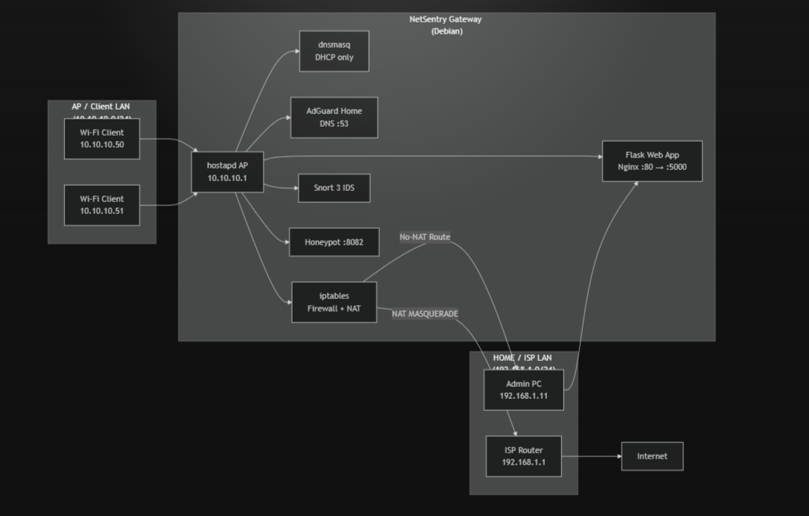
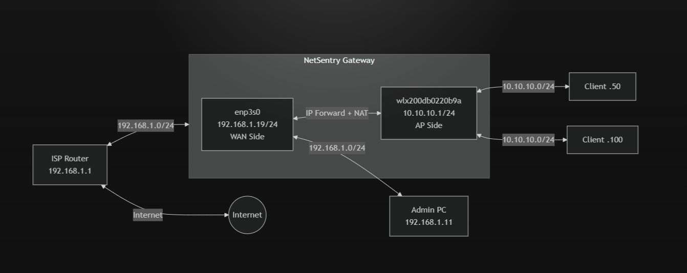
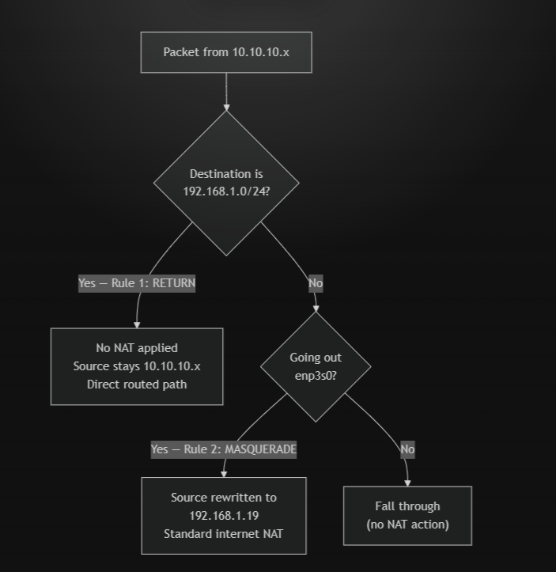
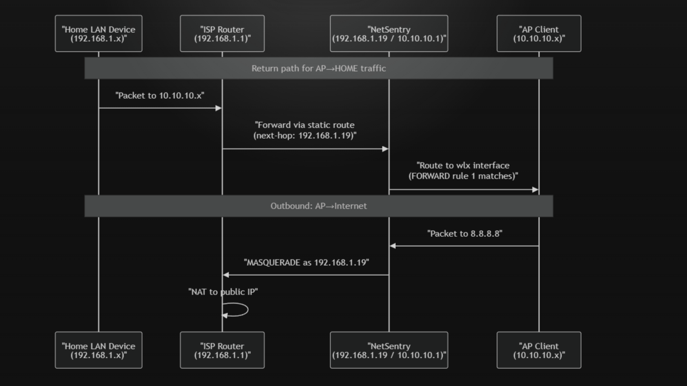
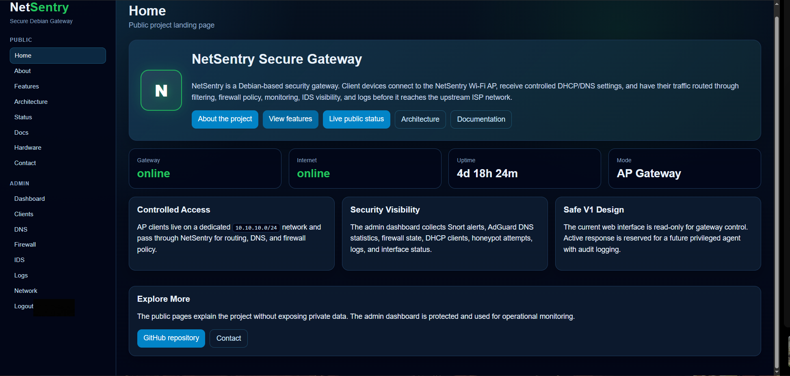
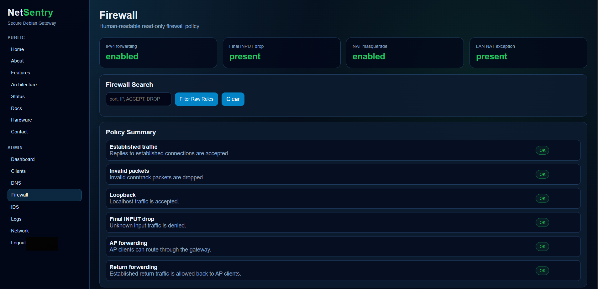
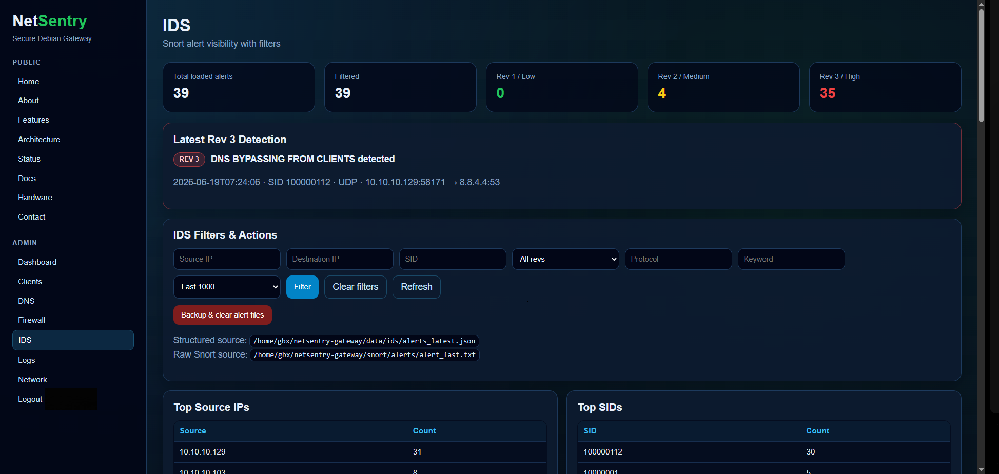
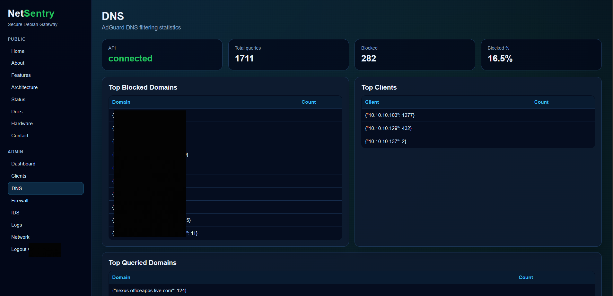
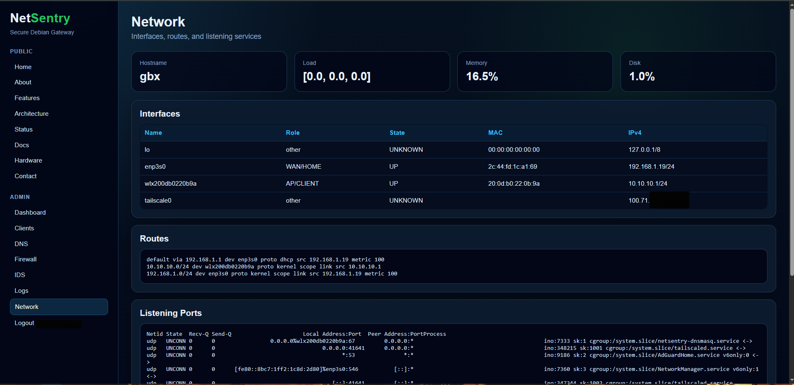

# NetSentry Gateway v1.8

<p align="center">
  
</p>

<p align="center">
  <b>Debian-based homelab security gateway</b><br>
  AP + DHCP + DNS filtering + firewall/NAT + HTTPS dashboard + Snort IDS + structured alert watcher
</p>

---

## Current Status

**NetSentry v1.8** is the current stable homelab gateway state of this project.

This repository contains the current working gateway stack plus older files kept as a chronological build log. Some scripts, old service names, old IP references, and previous dashboard versions are intentionally preserved to show how the project evolved.

The current active stack is documented in:

```text
docs/netsentry-ids-dashboard-progress.md
```

Historical files should not be interpreted as active services unless they are referenced by the current systemd services, current firewall script, current Flask dashboard, current Snort rules, or master documentation.

---

## Project Type

NetSentry is a **personal homelab/student cybersecurity project**.

It is not presented as an enterprise-ready production product. The goal is to demonstrate practical networking, Linux administration, gateway security, IDS integration, firewalling, service automation, and dashboard development in a real lab environment.

---

## What NetSentry Does

NetSentry turns a Debian machine into a small security gateway appliance.

Main capabilities:

* Creates a Wi-Fi AP/client network
* Provides DHCP to AP clients
* Provides DNS filtering through AdGuardHome
* Routes AP client traffic through Debian
* Applies firewall and NAT policy with iptables
* Exposes a HTTPS dashboard through Nginx
* Runs Flask as the internal dashboard backend
* Runs Snort as an AP-side IDS sensor
* Parses Snort alerts into structured JSON
* Displays IDS alerts in the dashboard
* Tracks Rev 3/high-severity detections
* Monitors important systemd services from the dashboard
* Supports remote administration through Tailscale

---

## Screenshots and Evidence

### 1. NetSentry Gateway Architecture



This diagram shows the current NetSentry gateway layout:

* AP/client LAN: `10.10.10.0/24`
* NetSentry AP gateway: `10.10.10.1`
* HOME/ISP LAN: `192.168.1.0/24`
* NetSentry HOME-side IP: `192.168.1.19`
* Admin laptop: `192.168.1.11`
* Debian gateway handling DHCP, DNS filtering, firewall/NAT, monitoring, and IDS visibility

---

### 2. Network Topology



This diagram shows the physical and logical path between:

* ISP router
* NetSentry gateway
* AP-side clients
* Admin PC
* Internet path
* HOME/WAN side
* AP/client side

---

### 3. NAT Decision Flow



This flow explains the NAT behavior:

* AP to HOME LAN traffic keeps the original `10.10.10.x` source
* AP to Internet traffic is masqueraded through `enp3s0`
* Traffic that does not match either case falls through with no NAT action

---

### 4. Return Path and Forwarding Flow



This sequence diagram shows:

* HOME LAN to AP LAN return routing
* ISP router static route behavior
* NetSentry forwarding through the AP interface
* AP client outbound traffic to the Internet
* NAT/MASQUERADE behavior for Internet-bound traffic

---

### 5. Public Landing Page



The public landing page presents NetSentry as a secure Debian gateway and gives access to project information, architecture, status, and documentation.

---

### 6. Admin Dashboard


The admin dashboard shows live gateway state:

* Internet status
* Uptime
* Client count
* IDS alert count
* DNS blocked count
* DNS block rate
* IPv4 forwarding status
* Firewall NAT status
* Service state
* Interface state

Visible active services include:

```text
nginx
AdGuardHome
netsentry_ap_interface
netsentry_snort_ap
netsentry_snort_watcher
hostapd_process
dnsmasq_process
snort_process
snort_watcher_process
```

---

### 7. Firewall Dashboard



The firewall dashboard provides a human-readable view of the active firewall policy.

It verifies:

* IPv4 forwarding
* Final INPUT drop
* NAT masquerade
* LAN NAT exception
* Established traffic handling
* Invalid packet dropping
* Loopback acceptance
* AP forwarding
* Return forwarding

---

### 8. IDS Dashboard



The IDS dashboard shows Snort alert visibility with filters and severity counters.

Current IDS dashboard features:

* Total loaded alerts
* Filtered alerts
* Rev 1 / low severity count
* Rev 2 / medium severity count
* Rev 3 / high severity count
* Latest Rev 3 detection panel
* Source IP filter
* Destination IP filter
* SID filter
* Rev filter
* Protocol filter
* Keyword filter
* Top source IPs
* Top SIDs
* Structured alert source display
* Raw Snort source display

---

### 9. DNS Dashboard



The DNS dashboard shows AdGuardHome integration.

It displays:

* API connection status
* Total DNS queries
* Blocked DNS queries
* DNS block percentage
* Top blocked domains
* Top clients
* Top queried domains

---

### 10. DHCP Client Visibility


The Clients page shows DHCP lease visibility for devices connected through the NetSentry AP/client network.

It displays:

* Client IP
* MAC address
* Hostname
* Lease expiry time

Sensitive MAC addresses and user-specific values should be redacted before public sharing.

---

### 11. Network Dashboard



The Network page shows Linux networking state:

* Hostname
* Load
* Memory usage
* Disk usage
* Interfaces
* Interface roles
* Interface state
* MAC addresses
* IPv4 addresses
* Routes
* Listening ports

It also confirms the presence of the Tailscale interface used for remote administration.

---

### 12. Client Connectivity Test

.png>)

This test screenshot shows a Windows client connected to the NetSentry Wi-Fi AP and successfully pinging important network points.

It demonstrates:

* AP availability
* Client association
* Reachability to NetSentry AP gateway
* Reachability to NetSentry HOME-side IP
* Reachability to admin/HOME-side network
* Dual-gateway routing behavior

---

### 13. AP Availability


This screenshot shows the NetSentry AP being visible from a client device.

---

### 14. DHCP Lease Evidence


This screenshot shows DHCP lease assignment from NetSentry to an AP client.

---

### 15. ISP Router Static Route


This screenshot shows the ISP router static route used to return traffic to the NetSentry AP/client subnet.

The static route allows HOME LAN devices to reach `10.10.10.0/24` through NetSentry.

---

## High-Level Architecture

```text
AP Client
   |
   | Wi-Fi / 10.10.10.0/24
   v
NetSentry AP Interface
wlx200db0220b9a / 10.10.10.1
   |
   | Debian firewall / NAT / routing / IDS
   v
NetSentry HOME/WAN Interface
enp3s0 / 192.168.1.19
   |
   v
Home Router / Internet
```

Web dashboard architecture:

```text
Browser
   |
   | HTTP/HTTPS
   v
Nginx :80/:443
   |
   | reverse proxy
   v
Flask app 127.0.0.1:5000
```

IDS pipeline:

```text
Snort on AP interface
   |
   v
snort/alerts/alert_fast.txt
   |
   v
Snort alert watcher
   |
   v
data/ids/alerts.jsonl
data/ids/alerts_latest.json
data/ids/latest_rev3.json
   |
   v
NetSentry IDS dashboard
```

---

## Network Layout

### HOME / Upstream Side

```text
Interface:        enp3s0
Network:          192.168.1.0/24
NetSentry IP:     192.168.1.19
Admin laptop IP:  192.168.1.11
```

### AP / Client Side

```text
Interface:        wlx200db0220b9a
Network:          10.10.10.0/24
Gateway IP:       10.10.10.1
SSID:             NetSentry-Test
DHCP range:       10.10.10.50 - 10.10.10.150
```

---

## Main Components

| Component           | Purpose                                   |
| ------------------- | ----------------------------------------- |
| Debian              | Base operating system                     |
| hostapd             | Wi-Fi AP service                          |
| dnsmasq             | DHCP for AP clients                       |
| AdGuardHome         | DNS filtering                             |
| iptables            | Firewall, NAT, forwarding policy          |
| Nginx               | HTTPS frontend and reverse proxy          |
| Flask               | Dashboard backend                         |
| Snort               | AP-side IDS sensor                        |
| Snort alert watcher | Converts Snort alerts into dashboard JSON |
| Tailscale           | Remote private administration             |
| systemd             | Boot automation for gateway services      |

---

## Active Systemd Services

Current important services:

```text
ssh.service
nginx.service
netsentry-web.service
netsentry-ap-interface.service
netsentry-firewall.service
netsentry-dnsmasq.service
hostapd.service
AdGuardHome.service
tailscaled.service
netsentry-snort-ap.service
netsentry-snort-watcher.service
```

Legacy/deprecated service names may still appear in older documentation or scripts, but they are not part of the current active v1.8 stack unless explicitly referenced in the master documentation.

Service check command:

```bash
for s in ssh nginx netsentry-web netsentry-ap-interface hostapd AdGuardHome tailscaled netsentry-firewall netsentry-dnsmasq netsentry-snort-ap netsentry-snort-watcher; do
  printf "%-32s enabled=%-12s active=%s\n" \
  "$s" \
  "$(systemctl is-enabled "$s" 2>/dev/null || echo not-found)" \
  "$(systemctl is-active "$s" 2>/dev/null || echo not-found)"
done
```

---

## Repository Structure

```text
app/
  netsentry_app.py              Flask dashboard backend
  static/css/netsentry.css      Dashboard styling
  templates/                    Flask templates

config/
  nginx/                        Nginx site configuration
  snort/                        Repository copy of Snort config
  systemd/                      Repository copies of systemd units
  ap/                           AP/DHCP-related config examples

docs/
  NETSENTRY_MASTER_DOCUMENTATION.md
                                Main project documentation

Pics/
  Logo.png
  Architecture.png
  1.png
  2.png
  3.png
  home.png
  admin dashboard.png
  FIREWALL.png
  IDS.png
  DNS.png
  CLEINTS .png
  network.png
  Client connected ( piging both gateways , Another client ,Admin).png

scripts/
  apply_firewall.sh             Active firewall/NAT script
  snort_alert_watcher.py        Snort alert parser/watcher

snort/
  rules/local_ap.rules          AP-side Snort rules
  alerts/                       Runtime Snort alert output, ignored by Git
  pcaps/                        Runtime packet captures, ignored by Git

data/
  ids/                          Runtime structured IDS data, ignored by Git
```

---

## Current Web Dashboard

The dashboard includes:

* Public project pages
* System status
* Service status
* Client/DHCP visibility
* DNS filtering statistics
* Firewall visibility
* Network interfaces/routes/listening ports
* Logs
* IDS alerts
* Rev-based alert filtering
* Latest Rev 3 alert card

Admin dashboard route:

```text
/admin/dashboard
```

IDS dashboard route:

```text
/admin/ids
```

IDS API route:

```text
/api/ids/alerts
```

---

## IDS Design

Snort runs on the AP/client interface:

```text
wlx200db0220b9a
```

This is intentional because AP-side capture sees the real client IPs before NAT.

Main Snort rules file:

```text
snort/rules/local_ap.rules
```

Main Snort configuration:

```text
/usr/local/etc/snort/snort.lua
```

Repository copy:

```text
config/snort/snort.lua
```

---

## Snort Variables

The rules use NetSentry-specific variables:

```text
$AP_LAN              10.10.10.0/24
$HOME_LAN            192.168.1.0/24
$ADMIN_IP            192.168.1.11
$AP_GATEWAY          10.10.10.1
$HOME_GATEWAY        192.168.1.19
$NETSENTRY_GATEWAY   [10.10.10.1,192.168.1.19]
```

These keep the rules readable and easier to maintain.

---

## Snort Alert Delay Fix

During development, Snort alerts were delayed because packet/event batching was active.

The working fast configuration is:

```lua
daq = {
    batch_size = 1
}

event_queue = {
    max_queue = 16,
    log = 16,
    order_events = 'priority'
}
```

Important behavior:

```text
daq.batch_size = 1 reduces alert delay.
event_queue.log = 16 allows multiple matching alerts per packet.
event_queue.log = 1 was too aggressive and hid some alerts.
```

---

## Snort Severity Convention

NetSentry v1.8 uses Snort `rev` as a project severity convention:

```text
rev:1 = low severity
rev:2 = medium severity
rev:3 = high / critical severity
```

In normal Snort usage, `rev` means rule revision. In this project, it is intentionally used to drive dashboard color and severity behavior.

Dashboard color mapping:

```text
Rev 1 = green
Rev 2 = yellow
Rev 3 = red
```

---

## Current Snort Rule Categories

Current AP-side Snort rules cover:

```text
ICMP ping from non-admin
Oversized ICMP payload
ICMP sweep
SSH SYN attempts
SSH repeated connection attempts
AdGuard UI access attempts
Old dashboard/API/test port probing
TCP SYN burst
TCP NULL scan
TCP FIN scan
TCP XMAS scan
TCP SYN/FIN scan
TCP SYN flood
UDP flood
TCP reset flood
DNS bypass attempts
FTP access attempts
FTP anonymous login attempts
AP client scanning AP clients
AP client probing sensitive gateway ports
SMB/RDP/Telnet-style access attempts
```

Example DNS bypass rule:

```snort
alert udp $AP_LAN any -> !$NETSENTRY_GATEWAY 53 (
    msg:"DNS BYPASSING FROM CLIENTS detected";
    sid:100000112;
    rev:3;
)
```

---

## HTTPS Limitation

Snort can detect HTTPS traffic at the network level, but it cannot inspect encrypted web paths.

Snort can detect:

```text
client IP
server IP
TCP port
TLS/HTTPS connection
scan behavior
DNS bypass
SSH attempts
gateway probing
flood behavior
```

Snort cannot see inside HTTPS:

```text
/admin/login
/admin/dashboard
HTTP headers
POST body
User-Agent
username/password fields
```

Therefore, NetSentry separates responsibilities:

```text
Snort       = network IDS
Nginx logs  = HTTPS request/path detection
Flask logs  = admin/auth detection
```

---

## Snort Alert Watcher

The watcher reads raw Snort alerts and writes structured JSON.

Watcher script:

```text
scripts/snort_alert_watcher.py
```

Input:

```text
snort/alerts/alert_fast.txt
```

Outputs:

```text
data/ids/alerts.jsonl
data/ids/alerts_latest.json
data/ids/latest_rev3.json
```

The watcher extracts:

```text
timestamp
Snort time
GID
SID
REV
severity
message
protocol
source IP
source port
destination IP
destination port
priority
raw alert line
```

The dashboard reads these structured files instead of parsing raw Snort output directly.

---

## Rev 3 Evidence Capture

The intended Rev 3 behavior is:

```text
Rev 3 alert detected
Watcher identifies source IP
tcpdump captures traffic for a short time window
PCAP is saved
Dashboard displays PCAP filename when available
```

Runtime PCAP folder:

```text
snort/pcaps/
```

PCAP files are binary. Read them with:

```bash
sudo tcpdump -nn -r file.pcap
```

or open them in Wireshark.

PCAP files are runtime evidence and are not committed to Git.

---

## Firewall Implementation

NetSentry currently uses **iptables-based firewall scripts** for the active gateway configuration.

References to nftables are historical/planned notes only and are not the active firewall implementation in v1.8.

Active firewall script:

```text
scripts/apply_firewall.sh
```

Active firewall service:

```text
netsentry-firewall.service
```

Key NAT behavior:

```bash
# AP to HOME LAN: no NAT, keep real client IP visible
iptables -t nat -A POSTROUTING -s "$AP_NET" -d "$HOME_LAN" -j RETURN

# AP to Internet: NAT through HOME/WAN interface
iptables -t nat -A POSTROUTING -s "$AP_NET" -o "$WAN_I" -j MASQUERADE
```

---

## Tailscale Remote Administration

NetSentry v1.8 supports remote private administration through Tailscale.

Tailscale interface:

```text
tailscale0
```

Purpose:

```text
Remote SSH access
Remote HTTPS dashboard access
Private administration without exposing the dashboard directly to the public Internet
```

Tailscale is not currently used as:

```text
exit node
subnet router
public VPN gateway
```

The current design is intentionally limited to direct private access to the NetSentry machine.

---

## Current vs Historical Files

This repository is kept as a chronological project build log.

Some files are deprecated or historical. They may contain:

```text
old service names
old IP addresses
older dashboard versions
older Snort rule experiments
old firewall approaches
test scripts
proof-of-concept services
```

These files are kept to show project evolution.

They are not part of the current active NetSentry v1.8 stack unless referenced by:

```text
docs/NETSENTRY_MASTER_DOCUMENTATION.md
current systemd service files
scripts/apply_firewall.sh
app/netsentry_app.py
snort/rules/local_ap.rules
config/snort/snort.lua
```

Deprecated files should be treated as historical build evidence, not active production code.

---

## Security and Secrets Policy

Never commit:

```text
Wi-Fi passphrases
AdGuard passwords
web dashboard passwords
NETSENTRY_WEB_SECRET
private TLS keys
.env files
runtime alert logs
runtime JSON alert files
pcap files
real credentials
```

Important secret locations outside Git:

```text
/etc/netsentry/netsentry-web.env
/etc/netsentry/certs/
```

Recommended secret check before commit:

```bash
git diff --cached | grep -Ei 'wpa_passphrase=|NETSENTRY_WEB_PASSWORD=|NETSENTRY_WEB_SECRET=|-----BEGIN .*PRIVATE KEY-----|PUT_YOUR_REAL_PASSWORD|PUT_A_LONG_RANDOM_SECRET' \
&& echo "STOP: real secret pattern found" \
|| echo "OK: no real secret patterns found"
```

---

## Runtime Files Ignored by Git

Runtime output should not be committed.

Ignored categories include:

```text
snort/alerts/*
snort/pcaps/*
data/ids/*.json
data/ids/*.jsonl
data/ids/rev3_flags/*
*.pcap
*.bak*
*.key
*.crt
```

---

## Testing Performed

PowerShell was used for simple client tests:

```text
ping
large ping
TCP connection attempts
DNS queries
port probes
```

Ubuntu VM was used for stronger tests:

```text
nmap scans
hping3 SYN tests
NULL/FIN/XMAS scans
DNS bypass testing
crafted traffic
```

Confirmed working:

```text
AP-side Snort live capture
Snort variables
detection_filter rules
fast Snort alerting
Snort AP service
Snort alert watcher
structured JSON output
IDS dashboard Rev filters
Latest Rev 3 display
dashboard service visibility
AdGuard DNS API integration
iptables firewall dashboard
Tailscale interface visibility
```

---

## Reboot Test Checklist

After reboot, verify:

```bash
for s in ssh nginx netsentry-web netsentry-ap-interface hostapd AdGuardHome tailscaled netsentry-firewall netsentry-dnsmasq netsentry-snort-ap netsentry-snort-watcher; do
  printf "%-32s enabled=%-12s active=%s\n" \
  "$s" \
  "$(systemctl is-enabled "$s" 2>/dev/null || echo not-found)" \
  "$(systemctl is-active "$s" 2>/dev/null || echo not-found)"
done
```

Functional tests:

```text
AP starts
client receives DHCP lease
client uses NetSentry as gateway
DNS filtering works
internet forwarding works
dashboard loads over HTTPS
Snort AP service is active
Snort watcher service is active
Snort alert appears after test traffic
IDS dashboard updates
latest Rev 3 card updates after Rev 3 alert
Tailscale interface appears
remote SSH through Tailscale works
```

---

## Known Unfinished Work

Still unfinished or optional:

```text
Actions dashboard
watch/restrict/ban/unblock clients
safe firewall enforcement helper
Nginx/Flask HTTPS attack watcher
home-side Snort sensor on enp3s0
final architecture diagram polish
final demo checklist
```

---

## Future Actions Dashboard Plan

Planned route:

```text
/admin/actions
```

Planned actions:

```text
Watch client
Restrict client
Ban client
Unblock client
```

Safe implementation order:

```text
1. UI only
2. state file only
3. watch mode
4. restrict mode
5. ban mode
6. unblock mode
7. firewall helper
```

Persistent state file:

```text
/var/lib/netsentry/client_actions.json
```

Never allow automatic blocking of:

```text
192.168.1.11
10.10.10.1
192.168.1.19
127.0.0.1
```

Never allow subnet blocking:

```text
10.10.10.0/24
192.168.1.0/24
```

---

## Current Stable State

NetSentry v1.8 currently provides:

```text
routing
AP access
DHCP
DNS filtering
firewalling
HTTPS dashboard
Snort AP IDS
Snort alert watcher
structured IDS alerts
Rev severity dashboard
service visibility
Tailscale remote administration
```

The project is now in a strong v1.8 homelab release state.

---

## Public Repository Readiness

Before making the repository public:

```text
README explains current vs historical files
legacy hardcoded password strings are removed or clearly deprecated
iptables/nftables mismatch is clarified
no real credentials are committed
no TLS private keys are committed
no Wi-Fi passphrase is committed
no runtime alerts or pcaps are committed
master documentation is current
reboot test passes
screenshots are redacted where needed
```

---

## Final Note

NetSentry v1.8 is a personal homelab security gateway project.

It is not an enterprise-ready product and is not presented as one. Its value is in demonstrating practical implementation of Linux networking, AP mode, DHCP, DNS filtering, firewalling, IDS monitoring, service automation, remote private administration, and dashboard visibility in a real working environment.
