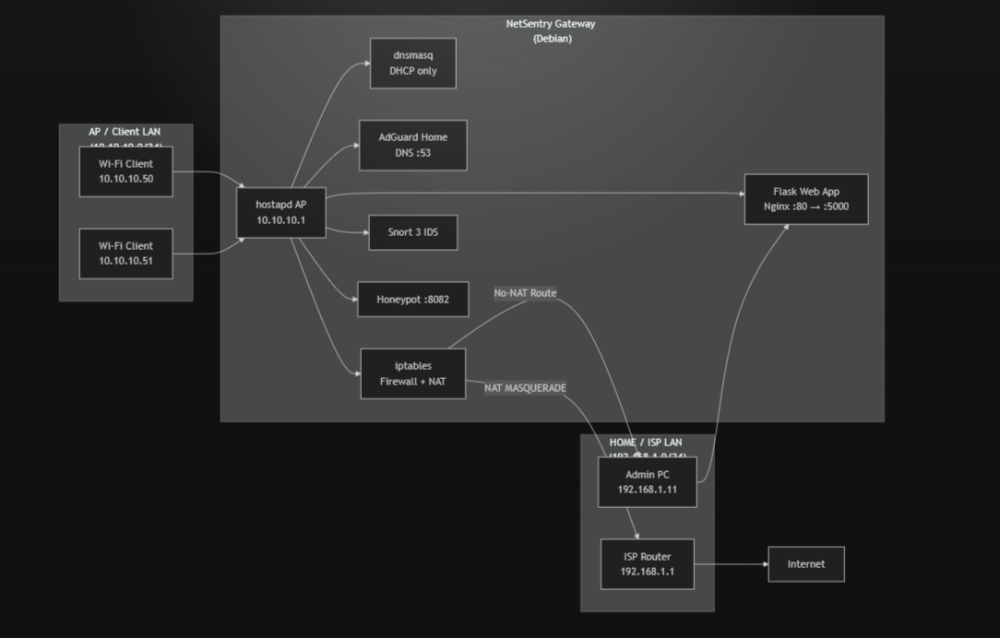
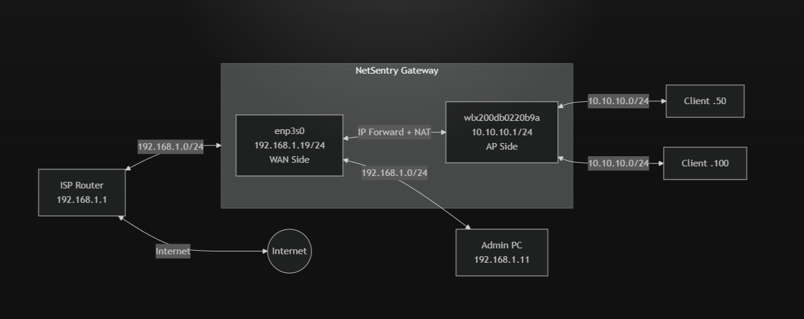
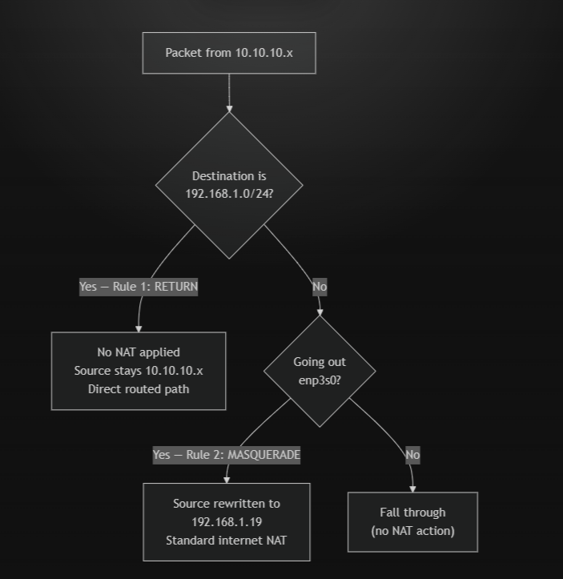
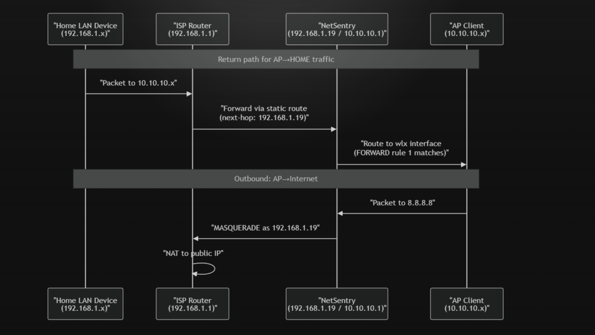
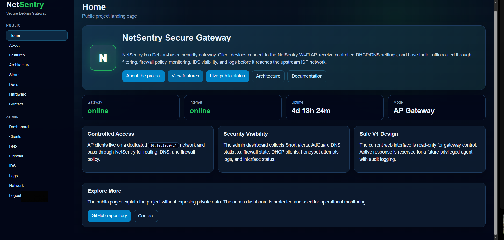
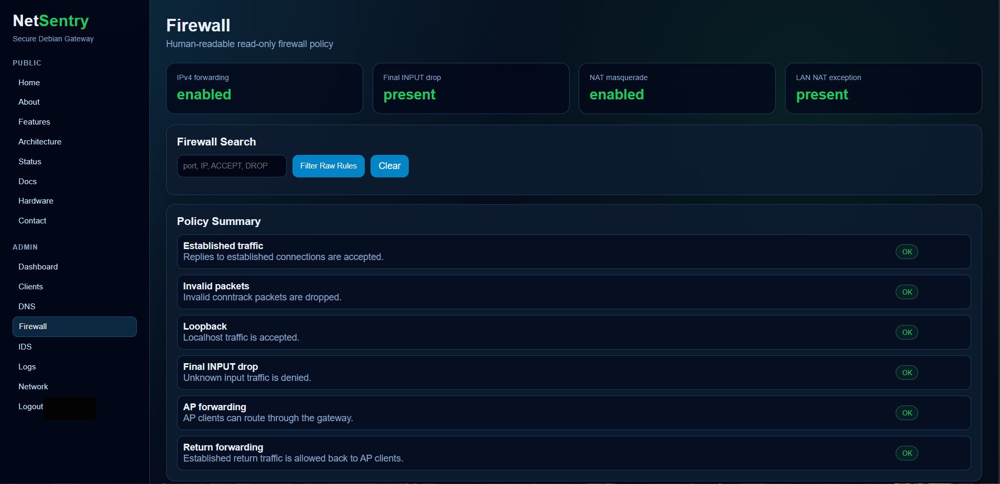
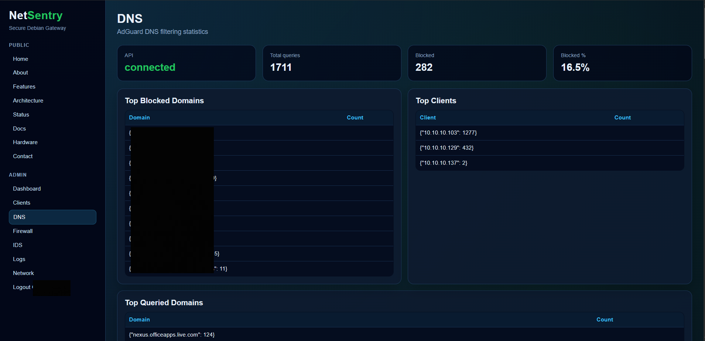
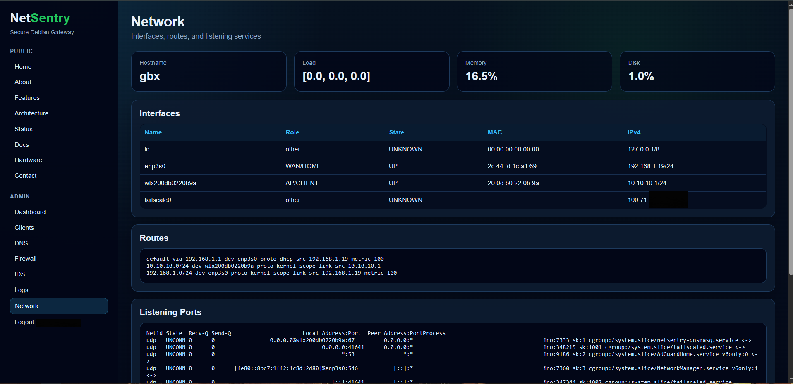

# NetSentry Gateway

<p align="center">
  
</p>

<p align="center">
  <b>Debian-based homelab security gateway</b><br>
  AP + DHCP + DNS filtering + firewall/NAT + HTTPS dashboard + Suricata IDS + Wazuh SIEM
</p>

<p align="center">
  <b>Current version: v2.6.0 — Stable</b>
</p>

---

## Current Status

**NetSentry v2.6.0** is the current stable state of this project.

This repository is kept as a chronological build log. It contains the current
working gateway stack plus older files from earlier stages of the project
(V0 through v1.9). Old service names, old IP references, and earlier dashboard
or IDS versions are intentionally preserved to show how the project evolved —
they are **not** part of the active stack unless referenced below.

The authoritative technical reference is:

```text
docs/NETSENTRY_MASTER_DOCUMENTATION.md
```

If anything in this README and the master documentation ever disagree, the
master documentation wins.

---

## Project Type

NetSentry is a **personal homelab / student cybersecurity project**.

It is not presented as an enterprise-ready product. Its purpose is to
demonstrate practical Linux networking, gateway security, IDS/SIEM
integration, firewalling, service automation, and dashboard development in a
real, continuously running lab environment — not a one-time lab exercise.

---

## What NetSentry Does

NetSentry turns a Debian machine into a small security gateway appliance
sitting between a home network and a set of Wi-Fi clients.

* Creates a Wi-Fi AP / client network
* Provides DHCP to AP clients
* Provides DNS filtering through AdGuard Home
* Routes AP client traffic through Debian
* Applies firewall and NAT policy with iptables
* Runs Suricata as the active IDS engine
* Feeds Suricata alerts, firewall logs, and system logs into Wazuh (SIEM)
* Exposes a read-only HTTPS operations dashboard through Nginx + Flask
* Monitors gateway services, DNS stats, clients, and firewall state
* Supports remote administration through Tailscale

---

## Architecture at a Glance

```text
AP Client
   |
   | Wi-Fi / 10.10.10.0/24
   v
NetSentry AP Interface
wlx200db0220b9a / 10.10.10.1
   |
   | Debian firewall / NAT / routing / Suricata IDS
   v
NetSentry HOME/WAN Interface
enp3s0 / 192.168.1.19
   |
   v
Home Router / Internet
```

Two separate dashboards, two separate jobs:

```text
NetSentry Dashboard (Flask/Nginx)  ->  Gateway operations & status
Wazuh Dashboard                    ->  Security investigation & alert triage
```

```text
Browser -> Nginx :80/:443 -> Flask 127.0.0.1:5000        (gateway ops)
Browser -> Nginx :8443     -> Wazuh dashboard             (SIEM)
```

IDS/SIEM pipeline:

```text
Suricata on AP interface (wlx200db0220b9a)
   |
   v
eve.json
   |
   v
Filebeat -> Wazuh manager -> Wazuh indexer -> Wazuh dashboard
```

Full component list, data flow, and every route/port/rule are documented in
`docs/NETSENTRY_MASTER_DOCUMENTATION.md`.

---

## Screenshots and Evidence

### Network Architecture



* AP/client LAN: `10.10.10.0/24`
* NetSentry AP gateway: `10.10.10.1`
* HOME/ISP LAN: `192.168.1.0/24`
* NetSentry HOME-side IP: `192.168.1.19`
* Admin laptop: `192.168.1.11`

### Network Topology / NAT / Return Path





These three diagrams together explain the full packet path: AP client → NAT
decision → HOME LAN or Internet → return path back to the AP client.

### Public Landing Page



### Admin Dashboard — Gateway Operations


Live gateway state: internet status, uptime, client count, DNS block rate,
IPv4 forwarding status, firewall/NAT status, service state, interface state.

### Firewall Dashboard



Human-readable view of the active firewall policy: IPv4 forwarding, final
INPUT drop, NAT masquerade, LAN NAT exception, established-traffic handling,
invalid packet dropping, loopback acceptance, AP/return forwarding.

### DNS Dashboard



AdGuard Home integration: total/blocked queries, block percentage, top
blocked domains, top clients, top queried domains.

### DHCP Client Visibility


Client IP, MAC address, hostname, lease expiry for devices on the AP network.
Sensitive MAC addresses and user-specific values are redacted before public
sharing.

### Network Dashboard



Hostname, load, memory/disk usage, interfaces, interface roles/state, MAC
addresses, IPv4 addresses, routes, listening ports, and confirms the
Tailscale interface used for remote administration.

### Connectivity Evidence

.png>)


Client association, DHCP lease assignment, reachability to both gateways,
and the ISP router static route that lets HOME LAN devices reach
`10.10.10.0/24` through NetSentry.

### Wazuh Dashboards


Security investigation view: Suricata alerts, firewall drop events, MITRE
ATT&CK mapping.

---

## Network Layout

### HOME / Upstream Side

```text
Interface:        enp3s0
Network:          192.168.1.0/24
NetSentry IP:      192.168.1.19
Admin laptop IP:   192.168.1.11
```

### AP / Client Side

```text
Interface:        wlx200db0220b9a
Network:          10.10.10.0/24
Gateway IP:        10.10.10.1
SSID:              NetSentry-Test
DHCP range:        10.10.10.50 - 10.10.10.150
```

---

## Main Components

| Component    | Purpose                                    |
| ------------ | ------------------------------------------- |
| Debian       | Base operating system                       |
| hostapd      | Wi-Fi AP service                            |
| dnsmasq      | DHCP for AP clients                         |
| AdGuard Home | DNS filtering                               |
| iptables     | Firewall, NAT, forwarding policy            |
| Nginx        | HTTPS frontend and reverse proxy            |
| Flask        | Gateway operations dashboard backend        |
| Suricata     | AP-side IDS engine                          |
| Wazuh        | SIEM — alert correlation and investigation  |
| Filebeat     | Ships Suricata/system logs into Wazuh       |
| Tailscale    | Remote private administration               |
| systemd      | Boot automation for gateway services        |

---

## Active Systemd Services

```text
ssh.service
nginx.service
netsentry-web.service
netsentry-ap-interface.service
netsentry-firewall.service
netsentry-dnsmasq.service
hostapd.service
AdGuardHome.service
tailscaled.service
suricata.service
wazuh-indexer.service
wazuh-manager.service
wazuh-dashboard.service
filebeat.service
```

Snort-named services (`netsentry-snort-ap`, `netsentry-snort-watcher`) are
**historical** — removed in v2.2 and no longer part of the active stack. They
may still appear in `docs/` build-log files.

Service check command:

```bash
for s in ssh nginx netsentry-web netsentry-ap-interface hostapd \
         AdGuardHome tailscaled netsentry-firewall netsentry-dnsmasq \
         suricata wazuh-indexer wazuh-manager wazuh-dashboard filebeat; do
  printf "%-32s enabled=%-12s active=%s\n" \
  "$s" \
  "$(systemctl is-enabled "$s" 2>/dev/null || echo not-found)" \
  "$(systemctl is-active "$s" 2>/dev/null || echo not-found)"
done
```

---

## Repository Structure

```text
app/
  netsentry_app.py              Current Flask dashboard backend (read-only)
  static/                       Dashboard CSS/JS
  templates/                    Flask templates (public + admin)

config/
  nginx/                        Nginx site configuration
  suricata/                     Repository copy of suricata.yaml
  wazuh/                        Repository reference copies (ossec.conf,
                                 local_rules.xml, jvm.options, Suricata SID map)
  systemd/                      Repository copies of active systemd units
  ap/                           AP/DHCP config examples (dnsmasq, hostapd)

docs/
  NETSENTRY_MASTER_DOCUMENTATION.md   Full technical reference (current)
  releases/                           Dated release notes, v1.9 -> v2.6
  *.md                                 Historical build-log docs (older stages)

Pics/                            Screenshots and diagrams

scripts/
  apply_firewall.sh             Active firewall/NAT script
  performance_check.sh          Resource usage check for Suricata + Wazuh
  netsentry_dashboard.py        Historical dashboard (superseded by app/)
  netsentry_portal.py           Historical dashboard/portal (superseded)
  netsentry_status_api.py       Historical status API (superseded)
  honeypot_lite.py              Historical decoy login service
  http_test_service.py          Historical test HTTP service
  start_python_services.py      Historical service launcher
  stop_python_services.py       Historical service stopper

suricata/
  rules/local.rules             Active AP-side Suricata rules

tests/
  *.md                          Manual validation test notes

NetSentry-Gateway-Architecture.pdf   Architecture reference document
```

---

## Current Web Dashboard

The Flask dashboard is intentionally **read-only** — it does not modify
firewall rules, restart services, or trigger packet captures.

Public routes: `/`, `/about`, `/features`, `/architecture`, `/status`,
`/docs`, `/hardware`, `/contact`

Admin routes (session-authenticated):

```text
/admin/dashboard
/admin/clients
/admin/dns
/admin/firewall
/admin/network
```

IDS/log investigation is **not** part of this dashboard as of v2.2 — that is
Wazuh's job. See [Dashboard Direction](#dashboard-direction-history) below.

---

## Dashboard Direction (History)

Earlier versions (up to v1.8) included a built-in Snort-based IDS dashboard
with routes like `/admin/ids` and `/api/ids/alerts`. As of **v2.2**, that
dashboard and its routes were removed from the Flask app. IDS/log
investigation moved entirely to Wazuh to avoid maintaining a second,
duplicate alert viewer.

| Dashboard | Responsibility            |
| --------- | -------------------------- |
| NetSentry | Gateway operations/status  |
| Wazuh     | Security investigation     |

---

## IDS Design

Suricata runs on the AP/client interface (`wlx200db0220b9a`) intentionally,
so it sees real client IPs before NAT rewrites them.

```text
Active rules file:     suricata/rules/local.rules
Repository config:     config/suricata/suricata.yaml
```

Rules use NetSentry-specific variables (`$AP_LAN`, `$HOME_LAN`, `$ADMIN_IP`,
`$AP_GATEWAY`, `$HOME_GATEWAY`, `$NETSENTRY_GATEWAY`) to stay readable.

Snort was the original IDS engine (through v1.8) and was removed in v2.2
after running alongside Suricata produced duplicate, noisy alerts. All Snort
work is preserved in git history and in `docs/` build-log files.

---

## Firewall Implementation

NetSentry uses **iptables** for the active firewall/NAT policy.
References to nftables anywhere in `docs/` are historical/planning notes
only — they were never the active implementation.

```text
Active script:   scripts/apply_firewall.sh
Active service:  netsentry-firewall.service
```

Key NAT behavior:

```bash
# AP to HOME LAN: no NAT, keep real client IP visible
iptables -t nat -A POSTROUTING -s "$AP_NET" -d "$HOME_LAN" -j RETURN

# AP to Internet: NAT through HOME/WAN interface
iptables -t nat -A POSTROUTING -s "$AP_NET" -o "$WAN_I" -j MASQUERADE
```

Dropped INPUT/FORWARD packets are logged with rate-limited, greppable
prefixes so Wazuh can correlate them:

```text
NETSENTRY_FW_INPUT_DROP
NETSENTRY_FW_FORWARD_DROP
```

> **Known inconsistency to fix:** `scripts/apply_firewall.sh` currently
> hardcodes `ADMIN_IP="192.168.1.10"`, while every other reference in this
> repository (Nginx config, Flask app, Suricata rules, docs, tests) uses
> `192.168.1.11`. Treat `192.168.1.11` as correct and update the firewall
> script to match before relying on admin-only firewall rules.

---

## Tailscale Remote Administration

```text
Interface: tailscale0
Purpose:   Remote SSH + remote HTTPS dashboard access without exposing
           NetSentry directly to the public Internet.
```

Tailscale is **not** used as an exit node, subnet router, or public VPN
gateway. Access is intentionally limited to the NetSentry host itself.

---

## Security and Secrets Policy

Never commit:

```text
Wi-Fi passphrases
AdGuard passwords
web dashboard passwords
NETSENTRY_WEB_SECRET
private TLS keys
.env files
runtime alert/log files
pcap files
real credentials
```

Secret locations outside git:

```text
/etc/netsentry/netsentry-web.env
/etc/netsentry/certs/
```

Pre-commit secret check:

```bash
git diff --cached | grep -Ei 'wpa_passphrase=|NETSENTRY_WEB_PASSWORD=|NETSENTRY_WEB_SECRET=|-----BEGIN .*PRIVATE KEY-----|PUT_YOUR_REAL_PASSWORD|PUT_A_LONG_RANDOM_SECRET' \
&& echo "STOP: real secret pattern found" \
|| echo "OK: no real secret patterns found"
```

> `scripts/netsentry_portal.py` (historical, superseded) still contains
> hardcoded placeholder values `ADMIN_PASSWORD = "PASSWORDHERE"` and
> `PORTAL_SECRET = "change_this_secret_later_please"`. They are unused
> placeholders, not real secrets, but should be replaced or removed before
> the repository is treated as public-facing, since they read as real
> credentials out of context.

---

## Known Unfinished / Optional Work

```text
Actions dashboard: watch / restrict / ban / unblock clients
Safe firewall enforcement helper
Nginx/Flask HTTPS attack watcher
Home-side Suricata sensor on enp3s0
Final architecture diagram polish
```

Planned route: `/admin/actions`
Planned persistent state file: `/var/lib/netsentry/client_actions.json`

Never allow automatic blocking of gateway/admin IPs or entire subnets
(`10.10.10.0/24`, `192.168.1.0/24`) — see the master documentation for the
full safe-implementation order.

---

## Current vs Historical Files

This repository is a chronological build log. Files under `docs/*.md`
(outside `docs/releases/`) and `scripts/netsentry_dashboard.py`,
`scripts/netsentry_portal.py`, `scripts/netsentry_status_api.py`,
`scripts/honeypot_lite.py`, `scripts/http_test_service.py` are historical
evidence of earlier project stages. They are **not** part of the active
v2.6 stack unless referenced by:

```text
docs/NETSENTRY_MASTER_DOCUMENTATION.md
current systemd service files (config/systemd/)
scripts/apply_firewall.sh
app/netsentry_app.py
suricata/rules/local.rules
config/suricata/suricata.yaml
config/wazuh/
```

---

## Final Note

NetSentry v2.6.0 is a personal homelab security gateway project. It is not
an enterprise-ready product and is not presented as one. Its value is in
demonstrating practical implementation of Linux networking, AP mode, DHCP,
DNS filtering, firewalling, IDS/SIEM integration, service automation, remote
private administration, and operational dashboard visibility in a real,
continuously running environment.
